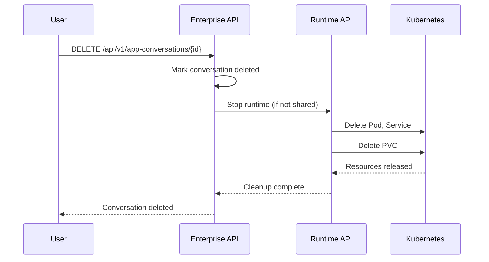

# Archive Sandbox

Delete conversations to release their Persistent Volume Claims (PVCs) and free storage resources. When you delete a conversation, OpenHands cleans up the sandbox including its PVC, releasing the storage quota.

This example demonstrates three operations: listing conversations, archiving a specific conversation, and bulk cleanup of stopped conversations.

## How It Works



When you delete a conversation:
1. The conversation is marked deleted in the database
2. If no other conversations share the sandbox, cleanup begins
3. All Kubernetes resources are removed: Pod, Service, PVC, Ingress
4. **The PVC deletion releases the storage quota**

## Prerequisites

- OpenHands API key
- Python 3.10 or later
- `requests` library: `pip install requests`

## Run It

### List All Conversations

```bash
python archive_sandbox.py list
```

```text
Conversations:
  ID: abc123def456
  Title: My Test Conversation
  Sandbox: m9dEVO2bDqar86rIaix93
  Status: STOPPED
  Cost: $0.43
```

### Archive a Conversation

```bash
python archive_sandbox.py archive <conversation_id>
```

The script shows conversation details and asks for confirmation before deleting.

### Bulk Cleanup

Archive all stopped conversations:

```bash
python archive_sandbox.py cleanup
```

## Complete Workflow Example

Run the end-to-end demonstration:

```bash
python example_create_and_archive.py
```

This creates a test conversation, shows its details, and archives it with confirmation.

## Sandbox vs Conversation Deletion

This example provides two cleanup approaches:

| Script | Deletes | Use When |
|--------|---------|----------|
| `archive_sandbox.py` | Conversation | Normal cleanup - respects shared sandboxes |
| `force_cleanup.py` | Sandbox directly | Need immediate storage release, testing |

> [!WARNING]
> `force_cleanup.py` bypasses checks and deletes the sandbox even if conversations reference it. Use only for testing or when you need immediate cleanup.

## Resource Lifecycle

| State | Pod | PVC | Storage Released |
|-------|-----|-----|------------------|
| RUNNING | Running | Exists | No |
| PAUSED | Scaled to 0 | Exists | No |
| STOPPED | Deleted | Exists | No |
| DELETED | Deleted | Deleted | ✅ **Yes** |

Pausing or stopping preserves the PVC for resume. Only deletion releases storage.

## Cleanup Strategies

<details>
<summary>Standard vs Fuse Sandboxes</summary>

OpenHands supports two sandbox types with different cleanup requirements:

**Standard (PVC-backed)**
- PVC provisioned at startup
- Workspace on persistent disk
- PVC persists through pause/resume
- Must delete conversation to release PVC

**Fuse/Dormant (S3-backed)**
- No PVC provisioned
- Workspace in S3 via fusey
- Fast resume without PVC
- Cleanup just deletes S3 objects

This example focuses on standard sandboxes where PVC cleanup matters.

</details>

## Best Practices

**Archive when:**
- Test conversations are complete
- Conversations stopped for > 7 days
- Failed or error conversations
- No longer need the workspace

**Before archiving:**
1. Download important files from the workspace
2. Export conversation history if needed
3. Check `conversation.tags.archiveworkspacepath` - OpenHands may auto-archive workspace to S3 before deletion

**Automatic workspace archiving:** If enabled (`RUNTIME_FILE_ARCHIVE_ENABLED=true`), OpenHands archives workspace contents to S3 before PVC deletion. Check the conversation's tags for the archive path.

## Force Immediate Cleanup

For immediate PVC release without waiting:

```bash
# List all sandboxes
python force_cleanup.py --list

# Force delete a sandbox (immediate)
python force_cleanup.py <sandbox_id>

# Delete all idle sandboxes
python force_cleanup.py --cleanup-idle
```

`force_cleanup.py` calls `DELETE /api/v1/sandboxes/{sandbox_id}`, which immediately triggers `delete_runtime_and_workspace_in_k8s()` in runtime-api.

## APIs Used

| Endpoint | Method | Purpose |
|----------|--------|---------|
| `/api/v1/app-conversations/search` | GET | List conversations |
| `/api/v1/app-conversations/{conversation_id}` | GET | Get conversation details |
| `/api/v1/app-conversations/{conversation_id}` | DELETE | Delete conversation, trigger cleanup |
| `/api/v1/sandboxes/{sandbox_id}` | DELETE | Force immediate sandbox cleanup |
| `/api/v1/sandboxes/{sandbox_id}/pause` | POST | Pause sandbox (preserves PVC) |

## Related

<!-- docs:cards -->

- [`start-sandbox`](../start-sandbox/) - Start a sandbox without a conversation
- [`clone-and-attach`](../clone-and-attach/) - Clone a repo and attach a conversation
- [OpenHands API Reference](https://app.all-hands.dev/docs) - Full API documentation
- [Runtime API](https://github.com/All-Hands-AI/runtime-api) - Sandbox management service

<!-- /docs:cards -->
