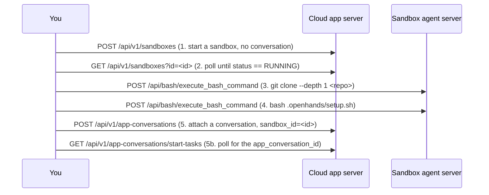

# Clone and Attach

This example provisions a sandbox **yourself** — shallow-cloning a git repo and
running its setup script — and only *then* hands it to an OpenHands agent by
**attaching a conversation** to that already-prepared sandbox.

It builds directly on [`start-sandbox`](../start-sandbox/), which shows the bare
sandbox lifecycle. Read that one first if the sandbox/agent-server split is new
to you.

## How It Works



Steps 1–2 use the **Cloud app server** (auth header `X-Session-API-Key: <OH_API_KEY>`).
Steps 3–4 use the sandbox's **agent server** (auth header
`X-Session-API-Key: <session_api_key>`, returned by the create call). Step 5 is
back on the Cloud app server. See [`start-sandbox`](../start-sandbox/) for more
on the two-server split.

### Where does `setup.sh` live?

In the repository, at `.openhands/setup.sh`. That is the exact location
OpenHands itself runs every time it starts working with a repo — see
[Repository Customization](https://docs.openhands.dev/openhands/usage/customization/repository).
This example runs that same file so the sandbox you hand off is set up the way
the agent would expect. If a repo has no `.openhands/setup.sh`, the step is
skipped with a note. (This repo ships a tiny one so the default run does
something visible.)

### Attaching is asynchronous

`POST /api/v1/app-conversations` returns a **start task**, not the conversation
itself. Poll `GET /api/v1/app-conversations/start-tasks?ids=<task_id>` until it
reports an `app_conversation_id`, then open
`https://app.all-hands.dev/conversations/<app_conversation_id>`.

## Run It

```bash
export OH_API_KEY=...        # your https://app.all-hands.dev API key
pip install requests

# Zero-config: clones this repo (it has a .openhands/setup.sh) and attaches
# a conversation that summarizes it.
python attach_conversation.py
```

Sample output:

```
sandbox: 1ho9eZpt4m27CC23XPdGcN
  sandbox status: RUNNING
agent: https://ahhygodzefollslv.prod-runtime.all-hands.dev

=== shallow clone https://github.com/OpenHands/enterprise-cookbook -> /workspace/enterprise-cookbook ===
$ git clone  (exit=0)

=== run .openhands/setup.sh ===
$ setup script  (exit=0)
[enterprise-cookbook setup.sh] running in /workspace/enterprise-cookbook
[enterprise-cookbook setup.sh] python: Python 3.13.13
[enterprise-cookbook setup.sh] done

=== attach conversation ===
  start-task status: STARTING_CONVERSATION
  start-task status: READY

Conversation attached to your prepared sandbox:
  https://app.all-hands.dev/conversations/f041a2e252cf45b39a46a3189b2efce7
```

Open that URL and you'll find the agent already in a workspace where your repo
is cloned and set up.

## Why Would I Do This?

Normally you start a conversation and OpenHands clones your selected repository
for you. Sometimes you want more control *before* the agent gets involved:

- pre-warm an environment so the agent starts instantly on an expensive setup,
- check out a specific commit, tag, or a sub-path of a monorepo,
- clone from a mirror or run custom bootstrapping the default flow doesn't do,
- reuse one prepared sandbox for several scripted conversations.

The trick is a single field: `POST /api/v1/app-conversations` accepts a
`sandbox_id`. Pass the id of a sandbox you already prepared and the new
conversation attaches to it instead of creating a fresh one.

## Point It at Your Own Repo

Every input is a flag with an environment-variable fallback, so the script is
safe to drop into your own automation unchanged:

| Flag | Env var | Default | Purpose |
|------|---------|---------|---------|
| `--api-key` | `OH_API_KEY` | — (required) | Cloud API key |
| `--base-url` | `OH_API_BASE` | `https://app.all-hands.dev` | Cloud app server |
| `--repo` | `REPO_URL` | this repo | Git URL to shallow-clone |
| `--branch` | `REPO_BRANCH` | repo default | Branch to check out |
| `--depth` | `CLONE_DEPTH` | `1` | `git clone --depth` |
| `--workdir` | `WORKDIR` | `/workspace` | Where the repo is cloned |
| `--setup-script` | `SETUP_SCRIPT` | `.openhands/setup.sh` | Script to run after clone |
| `--message` | `INITIAL_MESSAGE` | a summarize prompt | First message to the agent |
| `--sandbox-id` | `SANDBOX_ID` | none | Reuse a RUNNING sandbox instead of creating one |
| `--sandbox-spec-id` | `SANDBOX_SPEC_ID` | account default | Runtime image to start |
| `--poll-timeout` | `POLL_TIMEOUT` | `240` | Seconds to wait for readiness |

```bash
python attach_conversation.py \
    --repo https://github.com/your-org/your-repo \
    --branch main \
    --message "Run the test suite and fix any failures."
```

> Cloning a **private** repo? Start the sandbox with the appropriate git
> credentials available (e.g. via sandbox secrets) or clone over an
> authenticated URL. This example targets public repositories to stay simple.

## Cleanup

The sandbox is intentionally left running because a live conversation is now
attached to it — deleting the sandbox ends that conversation. Delete it from the
conversation UI, or via the API (the id goes in **both** the path and a required
`sandbox_id` query parameter):

```bash
SID=<sandbox_id>
curl -X DELETE "https://app.all-hands.dev/api/v1/sandboxes/${SID}?sandbox_id=${SID}" \
     -H "X-Session-API-Key: $OH_API_KEY"
```

## APIs Used

| Endpoint | Method | Purpose |
|----------|--------|---------|
| `/api/v1/sandboxes` | POST | Start a sandbox (no conversation) |
| `/api/v1/sandboxes` | GET | Poll until status == RUNNING |
| `{agent}/api/bash/execute_bash_command` | POST | Run `git clone` and `.openhands/setup.sh` in the sandbox |
| `/api/v1/app-conversations` | POST | Attach a conversation (`sandbox_id`) |
| `/api/v1/app-conversations/start-tasks` | GET | Poll for the `app_conversation_id` |

## Related

<!-- docs:cards -->

- [`start-sandbox`](../start-sandbox/) - The bare sandbox lifecycle and the sandbox/agent-server split
- [Repository Customization](https://docs.openhands.dev/openhands/usage/customization/repository) - Where `.openhands/setup.sh` lives

<!-- /docs:cards -->
