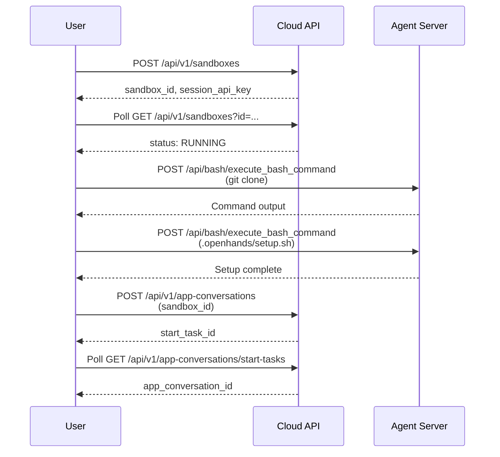

# Clone and Attach

Clone a repository and run its setup script in a sandbox, then attach a conversation to the prepared environment. This gives you control over the workspace before the agent starts.

Normally OpenHands clones your repository automatically. This example lets you control the clone (specific commit, branch, monorepo sub-path) and run custom setup before attaching a conversation.

## How It Works



**Steps:**
1. **Start a sandbox** without a conversation (`POST /api/v1/sandboxes`)
2. **Poll until RUNNING** (`GET /api/v1/sandboxes`)
3. **Clone the repository** via agent-server bash API
4. **Run `.openhands/setup.sh`** if it exists
5. **Attach a conversation** (`POST /api/v1/app-conversations` with `sandbox_id`)
6. **Poll for conversation ID** from the start task

> [!NOTE]
> `.openhands/setup.sh` is the standard OpenHands setup script location. See [Repository Customization](https://docs.openhands.dev/usage/customization/repository). This example runs the same script OpenHands would run automatically.

## Prerequisites

- OpenHands API key
- Python 3.10 or later
- `requests` library: `pip install requests`

## Run It

```bash
export OH_API_KEY=...        # your https://app.all-hands.dev API key
pip install requests

# Zero-config: clones this repo (it has a .openhands/setup.sh) and attaches
# a conversation that summarizes it.
python attach_conversation.py
```

Sample output:

```
sandbox: 1ho9eZpt4m27CC23XPdGcN
  sandbox status: RUNNING
agent: https://ahhygodzefollslv.prod-runtime.all-hands.dev

=== shallow clone https://github.com/OpenHands/enterprise-cookbook -> /workspace/enterprise-cookbook ===
$ git clone  (exit=0)

=== run .openhands/setup.sh ===
$ setup script  (exit=0)
[enterprise-cookbook setup.sh] running in /workspace/enterprise-cookbook
[enterprise-cookbook setup.sh] python: Python 3.13.13
[enterprise-cookbook setup.sh] done

=== attach conversation ===
  start-task status: STARTING_CONVERSATION
  start-task status: READY

Conversation attached to your prepared sandbox:
  https://app.all-hands.dev/conversations/f041a2e252cf45b39a46a3189b2efce7
```

Open that URL and you'll find the agent already in a workspace where your repo
is cloned and set up.

## Point It at Your Own Repo

Every input is a flag with an environment-variable fallback, so the script is
safe to drop into your own automation unchanged:

| Flag | Env var | Default | Purpose |
|------|---------|---------|---------|
| `--api-key` | `OH_API_KEY` | — (required) | Cloud API key |
| `--base-url` | `OH_API_BASE` | `https://app.all-hands.dev` | Cloud app server |
| `--repo` | `REPO_URL` | this repo | Git URL to shallow-clone |
| `--branch` | `REPO_BRANCH` | repo default | Branch to check out |
| `--depth` | `CLONE_DEPTH` | `1` | `git clone --depth` |
| `--workdir` | `WORKDIR` | `/workspace` | Where the repo is cloned |
| `--setup-script` | `SETUP_SCRIPT` | `.openhands/setup.sh` | Script to run after clone |
| `--message` | `INITIAL_MESSAGE` | a summarize prompt | First message to the agent |
| `--sandbox-id` | `SANDBOX_ID` | none | Reuse a RUNNING sandbox instead of creating one |
| `--sandbox-spec-id` | `SANDBOX_SPEC_ID` | account default | Runtime image to start |
| `--poll-timeout` | `POLL_TIMEOUT` | `240` | Seconds to wait for readiness |

```bash
python attach_conversation.py \
    --repo https://github.com/your-org/your-repo \
    --branch main \
    --message "Run the test suite and fix any failures."
```

> Cloning a **private** repo? Start the sandbox with the appropriate git
> credentials available (e.g. via sandbox secrets) or clone over an
> authenticated URL. This example targets public repositories to stay simple.

## Use Cases

**When to prepare a sandbox first:**
- Pre-warm expensive setups (large dependencies, build steps)
- Check out a specific commit, tag, or monorepo sub-path
- Clone from a mirror or private registry
- Run custom bootstrapping beyond `.openhands/setup.sh`
- Reuse one sandbox for multiple scripted conversations

## Cleanup

The sandbox continues running with the attached conversation. To delete it:

```bash
SID=<sandbox_id>
curl -X DELETE "https://app.all-hands.dev/api/v1/sandboxes/${SID}?sandbox_id=${SID}" \
     -H "X-Session-API-Key: $OH_API_KEY"
```

Or use the conversation UI to delete the conversation, which cleans up the sandbox.

## APIs Used

| Endpoint | Method | Purpose |
|----------|--------|---------|
| `/api/v1/sandboxes` | POST | Create a sandbox without a conversation |
| `/api/v1/sandboxes` | GET | Poll sandbox status until RUNNING |
| `{agent}/api/bash/execute_bash_command` | POST | Execute bash commands in the sandbox |
| `/api/v1/app-conversations` | POST | Attach a conversation to the sandbox |
| `/api/v1/app-conversations/start-tasks` | GET | Poll for conversation ID from start task |

## Related

<!-- docs:cards -->

- [`start-sandbox`](../start-sandbox/) - Start a sandbox without a conversation
- [`archive-sandbox`](../archive-sandbox/) - Delete conversations and release PVCs
- [Repository Customization](https://docs.openhands.dev/usage/customization/repository) - Setup script documentation

<!-- /docs:cards -->
